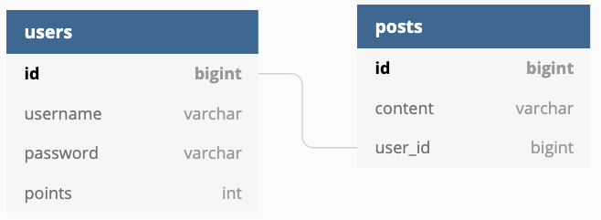

## goals
help small streamer gain more visibility

## notes
- 
    - `npm init -y` to initialize with defaults
    - `npm install typescript --save-dev` add ts as dev dep
    - Install ambient Node.js types for TypeScript
        - TypeScript has Implicit, Explicit, and Ambient types. 
        - Ambient types are types that get added to the global execution scope. 
        - Since we're using Node, it would be good if we could get type safety and auto-completion on the Node apis like file, path, process, etc. 
        - That's what installing the DefinitelyTyped type definition for Node will do.
        - `npm install @types/node --save-dev` (not done yet)  
        - create `tsconfig.json`:
            ```npx tsc --init --rootDir src --outDir build
            --esModuleInterop --resolveJsonModule --lib es6 
            --module commonjs --allowJs true --noImplicitAny true
            ```  
             - rootDir: This is where TypeScript looks for our code. We've configured it to look in the src/ folder. That's where we'll write our TypeScript.
            - outDir: Where TypeScript puts our compiled code. We want it to go to a build/ folder.
            - esModuleInterop: If you were in the JavaScript space over the past couple of years, you might have recognized that modules systems had gotten a little bit out of control (AMD, SystemJS, ES Modules, etc). For a topic that requires a much longer discussion, if we're using commonjs as our module system (for Node apps, you should be), then we need this to be set to true.
            - resolveJsonModule: If we use JSON in this project, this option allows TypeScript to use it.
            - lib: This option adds ambient types to our project, allowing us to rely on features from different Ecmascript versions, testing libraries, and even the browser DOM api. We'd like to utilize some es6 language features. This all gets compiled down to es5.
            - module: commonjs is the standard Node module system in 2019. Let's use that.
            - allowJs: If you're converting an old JavaScript project to TypeScript, this option will allow you to include .js files among .ts ones.
            - noImplicitAny: In TypeScript files, don't allow a type to be unexplicitly specified. Every type needs to either have a specific type or be explicitly declared any. No implicit anys.
    - added `DOM` to `tsconfig.json` `lib`
    - `npx tsc` to compile js code
    - Cold reloading is nice for local development. In order to do this, we'll need to rely on a couple more packages: ts-node for running TypeScript code directly without having to wait for it be compiled, and nodemon, to watch for changes to our code and automatically restart when a file is changed.
        `npm install --save-dev ts-node nodemon`

        

## __basic arch v1 - naive__


## stack
- typeORM
    - might switch to Prisma

### typeORM
- [Active Record v Data Mapper](https://stackoverflow.com/questions/3828265/is-data-mapper-a-more-modern-trend-than-active-record)
- Active Record pattern (used to start things off)
    - query methods defined in model itself
    - keeps things simple, for smaller apps
    - entities must extend the `BaseEntity` class
    - `export class User extends BaseEntity {`
- Data Mapper pattern (todo)
    - query methods define in repository class (like spring)
    - helps with maintainability
    - `const userRepository = connection.getRepository(User);`